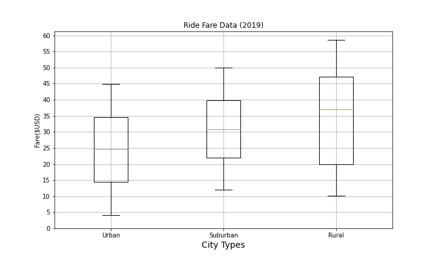

# PyBer_Analysis

## Overview
---
As an employee of PyBer, a Python based ride sharing company, analyst has been requested to perform exploratory data analysis on multiple large format .csv files related to city and ride sharing data in order to facilitate better understanding of best use of investment resources based on profitability or growth opportunities across cities in the United States.  Data includes two .csv datasets, including City_Data, a listing of Cities and Ride_Data, a listing of information about drivers, the rides they host and the fares paid.  Tables 1 and 2 below are short excerpts from these two tables.  

Table 1:  Sample City Data
 

Table 2:  Sample Ride Data


The goal of this analysis is to merge these two tables together and then analyze the data by creating summary data frames, performing summations, averages and other calculations and then plotting relevant data to visualizations that are meaningful to decision makers.

There are 120 records in the City Data file and 2,375 records in the Ride Data file.  Each table was inspected with Pandas/Python methods to check for the presence of null values, data types were noted before the two sets were merged.  At the conclusion of the merge, several summary dataframs were created by using groupby() methods and then the describe() function used to gather overall statistical information about the summary data sets.  Following are code snipets that show an example of grouping the larger merged data set into smaller data sets by city type and the results of the describe() function:

``` Pandas df creation using groupby() method
# Create the Urban city DataFrame.
urban_cities_df = pyber_data_df[pyber_data_df["type"] == "Urban"]
urban_cities_df.head()
```

``` Pandas code and output for the urban cities type dataframe.
# Get summary statistics.
urban_ride_count.describe()
# Get summary statistics.
urban_ride_count.describe()
count    66.000000
mean     24.621212
std       5.408726
min      12.000000
25%      21.000000
50%      24.000000
75%      28.000000
max      39.000000
Name: ride_id, dtype: float64
```


## Results
---

As the data was analyzed, the first exercise was to understand the city types, "Urban", "SubUrban" and "Rural" and comprehend how many rides were occurring in these city types and how many fares were being collected in each city.  The following scatter chart, configured as a bubble chart represents cities where coral colored markers are Urban, blue markers are Suburban and yellow markers are Rural cities.  The size of each bubble represents the total fares collected in that city.  The X axis represents the quantity of rides increasing from left to right and the vertical Y axis represents the average cost of fares.

Figure 1:  Pyber Ride Sharing Data


From this chart, it is evident that there are fewer rides occuring in Rural cities and the fares are generally higher.  Alternatively, increasing from Suburban to Urban are the quantity of rides and the potential for total fare collection.  Average fare decreases as you move from Rural to Suburban to Urban city types.

Another view of the summary data would be the following "box-and-whisker" plot.  This visualization focuses on Ride Count summary data.  In this view, one can tell several things about the underlying data.  The lowest number of rides for the Urban city type for example is 12 rides.  The box upper and lower boundaries represent the upper and lower quartiles (25%) and (75%), respectively.  The orange line in the middle of the box is the 50th percentile or in other terms, the median of that summary data set.  The standard deviation is a number between 4 and 5.  Outliers will show up outside of the top whisker.  There is only one outlier.  This data confirms what was represented in Figure 1 that generally there are more rides happening in Urban cities than Suburban and Rural Cities

Figure 2:  PyBer Ride Count Data


Additional summary box and whisker plots confirm the original scatter plot as it relates to Ride Fare Data and Driver Count Data:

Figure 3:  Pyber Ride Fare Data


Figure 4:  Pyber Driver Count Data


Similarly, the summary data is presented as percentages of the totals in the following pie charts:

Figure 5:  Pyber Ride Fare Data


Figure 6:  Pyber Driver Count Data


Figure 7:  Pyber Driver Count Data


## Summary
---
