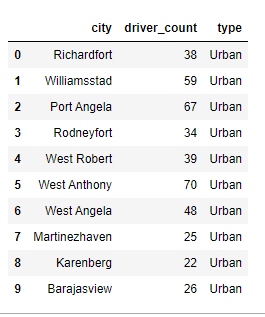

# PyBer_Analysis

## Overview
---
As an employee of PyBer, a Python based ride sharing company, analyst has been requested to perform exploratory data analysis on multiple large format .csv files related to city and ride sharing data in order to facilitate better understanding of best use of investment resources based on profitability or growth opportunities across cities in the United States.  Data includes two .csv datasets, including City_Data, a listing of Cities and Ride_Data, a listing of information about drivers, the rides they host and the fares paid.  Tables 1 and 2 below are short excerpts from these two tables.  

There are 120 records in the City Data file and 2,375 records in the Ride Data file.  Each table was inspected with Pandas/Python methods to check for the presence of null values, data types were noted before the two sets were merged.  At the conclusion of the merge, the describe() function used to gather overall statistical information about the combined data set.  Following is a code 

``` Pandas code and output for the urban cities type dataframe.
# Get summary statistics.
urban_ride_count.describe()
# Get summary statistics.
urban_ride_count.describe()
count    66.000000
mean     24.621212
std       5.408726
min      12.000000
25%      21.000000
50%      24.000000
75%      28.000000
max      39.000000
Name: ride_id, dtype: float64
```
Table 1:  Sample City Data
 

Table 2:  Sample Ride Data


The goal of this analysis is to merge these two tables together and then analyze the data by creating summary data frames, performing summations, averages and other calculations and then plotting relevant data to visualizations that are meaningful to decision makers.

## Results
---

## Summary
---
